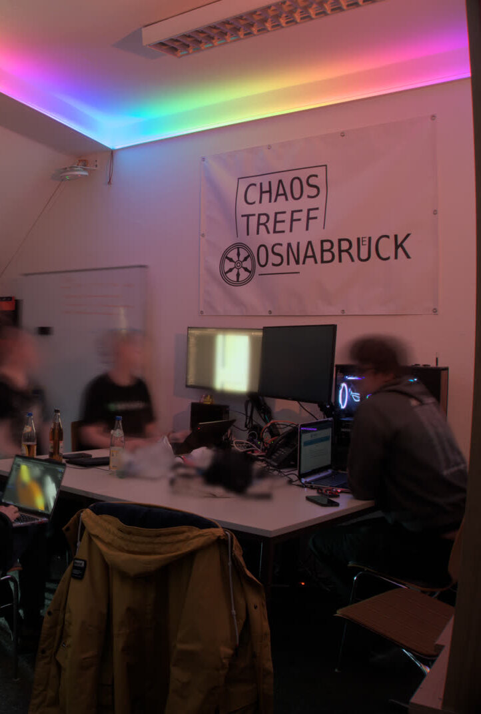
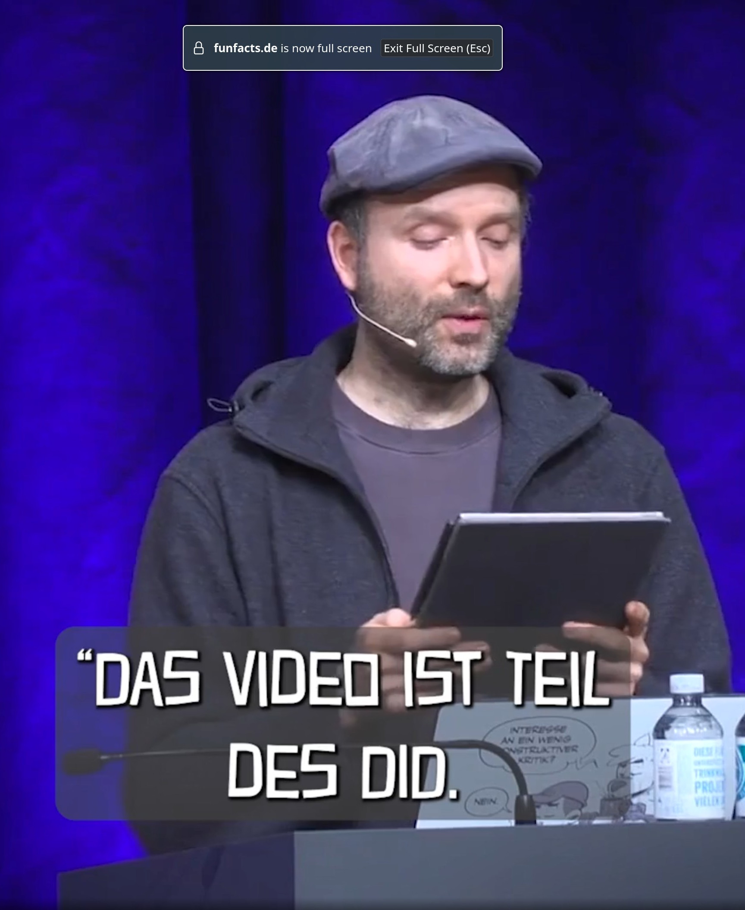
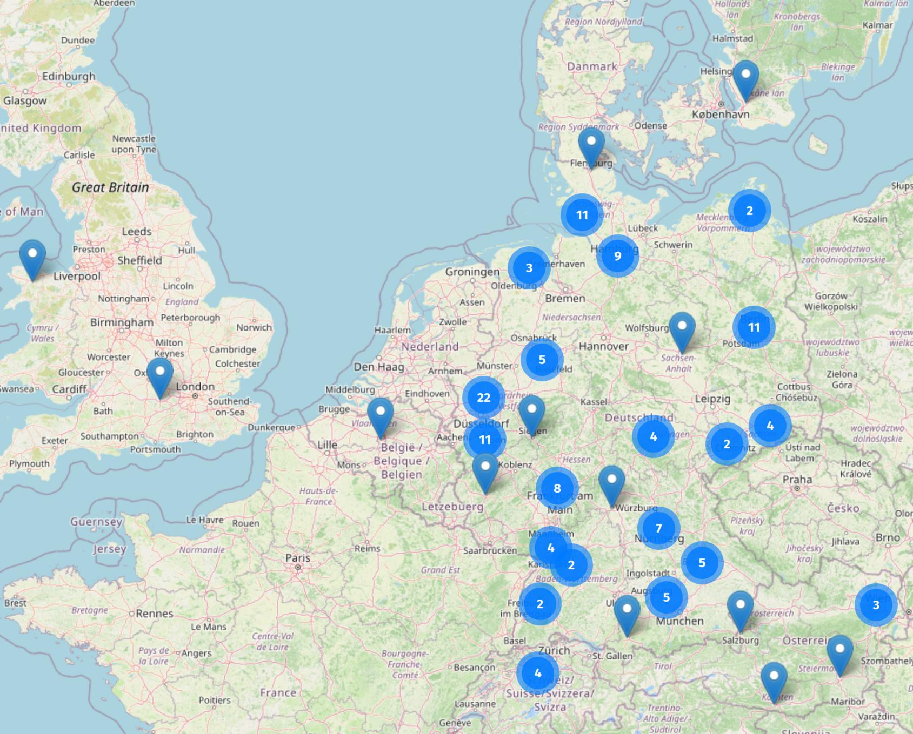

<!-- _class: board -->
<!-- _paginate: skip -->

  
  

    Digital Independence Day
    Wieso, weshalb, warum?
  

  

    Beginn
    10:00 Uhr
  

## Schon mal vormerken

  

    Sa, 3. Oktober·10–20 Uhr
    <strong class="date-what">Engagierte Stadt</strong>
    Osnabrück feiert Engagement. Lötworkshop für Anfänger*innen. Zeit für Fragen und Diskussion an unserem Stand auf dem Ledenhof.
  

  

    So, 4. Oktober·14–18 Uhr
    <strong class="date-what">Der nächste DIDAY</strong>
    Rabbithole, Alte Münze 12 Offenes Treffen ohne Vortrag - Austausch und Hilfe zur Selbsthilfe für mehr digitale Unabhängigkeit. Jeden ersten Sonntag im Monat.
  

  

    Jeden Donnerstag·ab 19 Uhr
    <strong class="date-what">Offener Chaostreff</strong>
    Rabbithole, Alte Münze 12 Offener Abend für alle, ob erfahren oder neugierig. Zum Projekte entwickeln, Ideen teilen und voneinander lernen.
  

  
  All creatures welcome!

---

<!-- _class: lead -->

Digitale Woche Osnabrück·24. September 2026

# Digital Independence Day

## Wieso, weshalb, warum?

Nils Israel

Chaostreff Osnabrück e.V.

[nils@sxda.io](mailto:nils@sxda.io)·[chaostreff-osnabrueck.de](https://chaostreff-osnabrueck.de)

---

## Über mich

- Studium **Mathematik** mit Nebenfach **Informatik**
- **Softwareentwickler**
- knapp 15 Jahre **Leitung IT** in einem großen Produktionsbetrieb
- Heute: **Softwareentwicklung** im Umfeld produzierender Unternehmen
- seit einem Jahr Mitglied im **Chaostreff Osnabrück e.V.**

### Interessen

Linux, Elektronik (gerne Dinge, die Geräusche machen), Basteleien, Brettspiele

### Kontakt

[nils@sxda.io](mailto:nils@sxda.io)·`@nils@osna.social`·`@nils:sxda.io`

---

## Der Chaostreff Osnabrück e.V.

ist seit 2015 ein offener Treffpunkt für Hacker\*innen, Technikbegeisterte und kreative Köpfe in Osnabrück, im Hackspace **Rabbithole** (Alte Münze 12, AStA der Uni Osnabrück).

- Offen für **alle** - unabhängig von Geschlecht, Hintergrund oder Erfahrungsstufe
- Gemeinsam **basteln, hacken, Wissen teilen** - von Hardware-Hacks bis IT-Sicherheit
- **Workshops**, **Vorträge** in respektvoller und inklusiver Atmosphäre
- Betrieb u.a. der **Mastodon**-Instanz <a href="https://osna.social">osna.social</a>
- **CCC-nah, aber eigenständig** - wir fühlen uns dem Chaos Computer Club verbunden und arbeiten mit ihm zusammen, sind aber nicht Teil davon

---

## Vorbeikommen beim Chaostreff

Jeden **Donnerstag ab 19 Uhr** - offen für alle, ohne Anmeldung.

- Wir sitzen zusammen, **basteln, hacken oder schnacken** - keine Voraussetzung, Expert\*in zu sein
- **Kunst, Musik, Gärtnern** oder was ganz anderes ist dein Ding? Auch das hat hier Platz und ist Teil von uns
- Meist **kein festes Programm** - eigenes Projekt mitbringen ist schön (Laptop, Hardware, Strickzeug …), aber kein Muss
- Vorab Fragen? **info@chaostreff-osnabrueck.de** oder im öffentlichen Matrix-Raum
- Unsere Grundsätze: **"All creatures welcome"** und **"Be excellent to each other"** 🏳️‍🌈🏳️‍⚧️

---

## Agenda

1. **Warum ist das ein Problem?** - Macht, Monopolismus, Datensammlung, Abhängigkeit
2. **Wie der Digital Independence Day entstand** - von der Idee zur Bewegung
3. Unser **Ansatz** und unsere **Werte**
4. **Was du tun kannst** - ein paar Beispiele für den Start
5. **Diskussion**

---

<!-- _class: chapter -->

# Warum ein Problem?

## Macht, Monopolismus, Datensammlung, Abhängigkeit

---

## Digitale Abhängigkeit

Große Technologiekonzerne kontrollieren mittlerweile große Teile unseres digitalen Lebens:

- Sie **sammeln massiv Daten** über uns
  - Standortdaten, Suchanfragen, Einkäufe, Zahlungen, Likes, ...
- Sie **beeinflussen durch ihre Algorithmen** unsere Wahrnehmung
  - Timeline auf Twitter/X, Instagram, TikTok, Facebook, etc.
  - Zielsetzung der Nutzenden und der Betreiber ist sehr unterschiedlich
  - Der Betreiber behält die Kontrolle
- Sie haben **enorme Macht** über unser Leben
  - Was wir lesen, hören oder sehen: auf Instagram, YouTube oder Spotify
  - Wie lange wir "doomscrollen"
  - Ob wir einfach mit unseren Daten umziehen können

> Das ist ein Problem für unsere **Privatsphäre**, für die **Demokratie** und für ein **freies Internet**.

---

<!--
Databroker Files (netzpolitik.org / BR), Überblick:
https://netzpolitik.org/2024/databroker-files-die-grosse-datenhaendler-recherche-im-ueberblick/

Selbsttest: Wurde mein Handy-Standort verkauft?
https://netzpolitik.org/2024/databroker-files-jetzt-testen-wurde-mein-handy-standort-verkauft/

Sicherheitsrisiko (Militär, Geheimdienste):
https://netzpolitik.org/2024/databroker-files-wie-datenhaendler-deutschlands-sicherheit-gefaehrden/
-->

## Datensammlung: Alles in einer Hand

- Konzerne verknüpfen Daten über viele Dienste hinweg: Suche, E-Mail, Karten, Smartphone, Zahlungen.
- Daten aus Apps landen bei Datenhändlern und werden an jeden verkauft, der zahlt.
- Beispiel **[Databroker Files](https://netzpolitik.org/databroker-files/)** (2024, netzpolitik.org)
  380 Millionen Standortdaten aus 137 Ländern, darunter Bewegungsprofile

---

<!--
1. Das ist falsch: Geheimnisse formen unsere Identität. Außerdem geben Sie die PIN zu Ihrer Bankkarte ja (hoffentlich) nicht weiter - und die Klotür machen Sie (wahrscheinlich) auch hinter sich zu.
2. Das ist unüberlegt: Denn es missachtet den Zusammenhang zwischen Freiheit, Geheimnissen und Machtverhältnissen: Jemand, der alles über uns weiß, kann uns leicht erpressen oder manipulieren.
3. Das ignoriert gesellschaftlichen Wandel: Was heute gesellschaftlich akzeptiert ist, könnte Sie schon morgen in Schwierigkeiten bringen. Denn Zeiten ändern sich. Und auch das, was wir als richtig und falsch einstufen.
4. Das ist geschichtsvergessen: Denn es lässt die Folgen radikaler Regierungswechsel außer Acht. Die deutsche Geschichte zeigt, dass gesammelte Informationen über die Bevölkerung in den Händen von radikalen Regimen ein erschreckendes Missbrauchspotential entfalten.
5. Das ist logisch falsch: Es impliziert: Wenn Sie etwas zu verbergen haben, haben Sie etwas Falsches getan, was Sie jetzt verheimlichen müssen. Das ist ein weit verbreiteter logischer Fehlschluss (Inversionsfehler).
6. Das ist übergriffig und wertend: Denn es vermittelt, dass Sie sich einer Norm unterwerfen müssen, um toleriert zu werden. Wer „komische" Sachen im Bett macht, Haschisch raucht oder eine Liebesaffäre hat, wird in einen Topf mit Kriminellen geworfen.
7. Das ist naiv: Eine einzelne Information wie z. B. Ihr Geburtsdatum oder Ihr Hobby mag harmlos sein. Aber aus vielen solchen Daten werden im großen Stil Profile konstruiert und genutzt, um unser Verhalten vorauszusagen und zu manipulieren.
8. Das ist unsolidarisch: Je mehr Menschen glauben, dass sie nichts zu verbergen hätten, desto verdächtiger wird es, überhaupt Geheimnisse zu haben.
9. Das ist ignorant: Geheimnisse – das wissen nicht nur Jugendliche in der Pubertät – sind entscheidend für unsere Identitätsfindung. Gerade, um den vielen unterschiedlichen Rollen im Alltag gerecht zu werden, müssen wir selbst entscheiden, wer was über uns erfährt.
10. Das ist demokratiefeindlich: Ohne Vertraulichkeit ist keine freie Meinungsbildung möglich, was Grundvoraussetzung für freie Wahlen ist. Es gibt einen guten Grund, weshalb es Wahlkabinen gibt.
11. Das ist privilegiert: Diese Haltung muss man sich leisten können. Menschen, die befürchten müssen, wegen diskriminierter Merkmale angegriffen zu werden, können wohl nicht so frei heraus sagen, sie hätten nichts zu verbergen.
-->

## Nichts zu verbergen? Wirklich?

- Geheimnisse schützen **Identität und Freiheit** - nicht nur, wer etwas Falsches getan hat
- Aus vielen einzelnen, harmlosen Daten entstehen **Profile**, die uns vorhersagen und lenken
- Transparenz gehört **nach oben** (Politik, Institutionen, Macht) - Geheimnisse **nach unten** (Privatleben, Schutz, freie Meinungsbildung)

Niemand hat nichts zu verbergen.

<small>Quelle: [digitalcourage.de/nichts-zu-verbergen](https://digitalcourage.de/nichts-zu-verbergen)</small>
<small>Bild: Alex Snaps (<a href="https://www.flickr.com/photos/alexsnaps/7166752339/in/photolist-bVitMv">Flickr</a>), CC-BY 2.0</small>

---

## Algorithmen sind nicht neutral 1/3

- Plattformen verdienen Geld mit Werbung und mit Daten, aus denen Profile für „bessere“ Werbung entstehen.
- Nutzende wollen Inhalte, die sie interessieren, und Inhalte von Menschen, die sie kennen oder mögen.
- Der naive Gedanke: Das ergänzt sich prima.
  - Liken oder Zu-Ende-Schauen markiert Inhalte als interessant.
  - Nutzende bekommen mehr relevante Inhalte.
  - Der Betreiber bekommt Daten für seine Werbeprofile.

---

## Algorithmen sind nicht neutral 2/3

<!--
Driven into Darkness: How TikTok’s ‘For You’ Feed Encourages Self-Harm and Suicidal Ideation
https://www.amnesty.org.uk/knowledge-hub/all-resources/report-driven-into-darkness/

EU-Kommission: süchtig machendes Design von TikTok verstößt gegen den DSA (vorläufige Feststellung)
https://germany.representation.ec.europa.eu/nachrichten-und-veranstaltungen/pressemitteilungen/eu-kommission-suchtig-machendes-design-von-tiktok-verstosst-gegen-den-dsa-2026-02-11_de
-->

### Problemszenario 1: Wenn der Betreiber „nur“ Geld verdienen will

- Je länger Nutzende am Gerät bleiben, desto mehr Werbung wird ausgespielt.
- Angezeigt wird nicht das Relevanteste, sondern das, was am meisten fesselt: Clickbait, Empörung, Extremes.
- Die Folgen: Dopaminkicks, Suchtverhalten, Doomscrolling.

---

<!--
Platformer (15.02.2023): Yes, Elon Musk created a special system for showing you all his tweets first
https://www.platformer.news/yes-elon-musk-created-a-special-system/

t3n: Twitter: Musk lässt System entwickeln, um eigene Tweets zu pushen
https://t3n.de/news/musk-tweets-entwickler-system-push-1534318/

-->

## Algorithmen sind nicht neutral 3/3

### Problemszenario 2: Wenn der Betreiber eine Agenda verfolgt

- Die Auswahlalgorithmen sind geheim, deshalb fällt Manipulation kaum auf.
- Beiträge bestimmter Personen (z. B. des CEOs) könnetn bevorzugt werden.
- Politische Inhalte könnten gezielt verstärkt oder gedrosselt werden.

---

<!--
https://www.heise.de/news/Wie-ein-franzoesischer-Richter-von-den-USA-digital-abgeklemmt-wurde-11087453.html
https://www.lemonde.fr/en/international/article/2025/11/19/nicolas-guillou-french-icc-judge-sanctioned-by-the-us-you-are-effectively-blacklisted-by-much-of-the-world-s-banking-system_6747628_4.html
https://www.heise.de/news/Von-US-Regierung-als-Terroristen-eingestuft-Hackerkollektiv-A-I-gibt-auf-11444557.html
https://www.sueddeutsche.de/wirtschaft/hilfe-e-v-kuendigungen-bankkonten-deutschland-ofac-li.3358715

-->

## Macht durch Monopole

- Wenige Konzerne kontrollieren zentrale Infrastruktur: Betriebssysteme, App-Stores, Cloud, Zahlungsverkehr.
- **Lock-in:** Wechseln ist schwer, weil Daten, Kontakte und Gewohnheiten an einem Anbieter hängen.
- **Netzwerkeffekt:** Man bleibt, weil alle anderen auch da sind.
- US-Konzerne unterliegen US-Recht, auch wenn die Server in Europa stehen (CLOUD Act).
- Es entscheiden nicht Gesetze und Gerichte, sondern Konzerne.

### Sanktionslisten der USA, Beispiele:

- ICC, 6 Richter und 3 Ankläger, z.B. Nicolas Guillou: "Digitaler Rückfall in die 90er"
- Rote Hilfe e.V., GLS und Sparkasse sperren Konten
- Autistici/Inventati (Mailkonten, Blogs, Websites), u.a. Blog von Anne Roth

---

<!-- _class: chapter -->

# Wie der DID entstand

## Von der Idee zur Bewegung

---

## Wie alles begann

**2025** startete die Initiative **savesocial.eu** eine Kampagne für digitale Unabhängigkeit.

**Marc-Uwe Kling** griff die Idee auf und rief am **27.12.2025** auf dem **39. Chaos Communication Congress** (39C3) in Hamburg zum Mitmachen auf.

Der Funke sprang über: Aus dem Umfeld des CCC entstanden die ersten **Digital Independence Days ab dem 4. Januar 2026**.

Inzwischen haben sich auch viele andere Initiativen, Vereine und engagierte Menschen angeschlossen.

<small>Bildausschnitt: Vortrag Die Känguru-Rebellion, 39C3, [tube.funfacts.de](https://tube.funfacts.de/w/71fg7mAm2AqyEPxXNAgEpn) (Attribution - Non Commercial), vollständiger Vortrag auf [media.ccc.de](https://media.ccc.de/v/39c3-die-kanguru-rebellion-digital-independence-day)</small>

---

## events.diday.org

- Event-Plattform für die DIDAY-Bewegung
- bereitgestellt vom CCC Flensburg
- 380 Organisationen
- 1277 anstehende Events

### 2 in Osnabrück

- Chaostreff Osnabrück e.V.
- Linuxtreff Osnabrück

<small>Stand 23.09.2026</small>

---

<!-- _class: chapter -->

# Unser Ansatz

---

## Wofür wir stehen

- **Informieren, nicht missionieren**
  Wir liefern Fakten und Optionen. Was du daraus machst, entscheidest du.
- **Ehrliche Alternativen**
  Jede Empfehlung hat Stärken und Schwächen. Die perfekte Lösung gibt es nicht.
- **Zugänglich für alle**
  Vom ersten Schritt bis zum Selbsthosting.
- **Keine Werbung**
  Wir machen unsere Arbeit unentgeltlich, nehmen kein Geld von Unternehmen und verdienen nichts an deinem Wechsel. Unser Maßstab sind die Prinzipien, nicht die Unternehmen.

---

<!--
Faktisch nicht richtig: auch US-Anbieter in der EU unterliegen den strengeren Datenschutzgesetzen. Aber eben auch dem US-Recht.
Es geht nicht nur um Gesetze sondern auch um die Durchsetzung!
-->

## Dezentral statt nur woanders

- Es geht **nicht** um Herkunftsländer oder „wir gegen die“.
- Das Problem ist **Machtkonzentration**, egal wo der Konzern sitzt.
- "Nur" von **US-BigTech** zu **EU-BigTech** zu wechseln verschiebt die Macht.
- Aber: Unternehmen in der EU unterliegen strengeren Datenschutzgesetzen.

### Dezentralität verteilt die Macht

- **E-Mail mit eigener Domain:** vorname@nachname.de Anbieter wechselbar, Adresse bleibt.
- **Fediverse:** Viele unabhängige Server, ein gemeinsames Netzwerk.
- **Föderierte und dezentrale Systeme** geben die Kontrolle zurück an die Nutzer\*innen.

### Wenn das nicht geht

- **Offene Formate** bevorzugen.
- Die Daten sollten **exportierbar** sein.

---

<!-- _class: quote -->

# DIDAY im CCC-Kontext

> Der Zugang zu Computern und allem, was einem zeigen kann, wie diese Welt funktioniert, sollte unbegrenzt und vollständig sein.
>
> Alle Informationen müssen frei sein.
>
> Mißtraue Autoritäten – fördere Dezentralisierung.
>
> Öffentliche Daten nützen, private Daten schützen.

Auszug aus der **Hackerethik des Chaos Computer Clubs** · [ccc.de/hackerethics](https://www.ccc.de/hackerethics)

---

## Jeder Schritt zählt

- **Kein Alles-oder-nichts**
  WhatsApp behalten, aber OpenStreetMap statt Google Maps nutzen? Großartig, das ist ein echter Schritt.
- **Wir bewerten nicht**
  Es gibt gute Gründe, bei manchen Diensten zu bleiben: Familie, Verein, Arbeit, Gewohnheit.
- **Im Zweifel: Plus-1**
  Den alten Dienst behalten und den neuen dazunehmen, z. B. Signal neben WhatsApp.
- **Freund\*innen mitnehmen**
  Bring deine Freund\*innen, Familie und Kolleg\*innen mit zu einem DIDAY.

> **Netzwerkeffekt:** Sprich drüber, persönlich oder auf Social Media mit #DIDit.

---

<!-- _class: chapter -->

# Was du tun kannst

## Konkrete erste Schritte

---

## E-Mail

- Anbieter wie **[mailbox.org](https://mailbox.org)**, **[posteo.de](https://posteo.de)**, **[proton.me](https://proton.me)**, die besonders transparent und datenschutzfreundlich arbeiten
- Bei mailbox.org und proton.me kann man seine eigene Domain nutzen
- Die ist unabhängig vom Anbieter und kann mitgenommen werden.
- Einmalig ist etwas Einrichtung erforderlich (wir helfen gerne dabei).

---

## Messenger

WhatsApp gehört **Meta** - zentral kontrolliert, Metadaten-Auswertung.

- **Signal** - Ende-zu-Ende-verschlüsselt, quelloffen, gemeinnützig. Nicht perfekt (braucht eine Telefonnummer, läuft auf AWS-Servern), aber **derzeit die komfortabelste Alternative**
- **Threema** - aus der Schweiz, ohne Telefonnummer nutzbar, kostenpflichtig (einmalig ca. 5 €)
- **Matrix** - dezentrales Protokoll, mehrere Anbieter, nur für technisch Versierte
- **Telegram** - nur mit Vorbehalt, Chats standardmäßig nicht Ende-zu-Ende-verschlüsselt, teilweise auch kostenpflichtig

---

## osna.social - das Fediverse vor Ort

Seit **2018** betreibt der Chaostreff Osnabrück eine eigene **Mastodon-Instanz**.

- Teil des **Fediverse** - viele unabhängige Server, ein gemeinsames Netzwerk
- Kein Konzern im Hintergrund, kein Algorithmus, der dich halten will
- Folge Menschen auf **jedem** anderen Fediverse-Server, nicht nur auf [osna.social](https://osna.social)
- **Dezentralität**

---

## Cryptomator - Verschlüsselung, egal wo die Daten liegen

Deine Cloud-Dateien clientseitig verschlüsseln, **bevor** sie beim Anbieter landen:

- Klappt mit vielen Cloud-Speicher Anbietern: Nextcloud, Dropbox, Google Drive, OneDrive, etc.
- **Quelloffen** und kostenlos für Desktop und Smartphones, Verschlüsselung passiert nur auf deinem Gerät
- Der Anbieter sieht nur **verschlüsselte Daten** - nicht deine Dateinamen, nicht deine Inhalte
- Du musst dafür **nicht den Anbieter wechseln**, um sicher zu sein
- [cryptomator.org](https://cryptomator.org/)

---

## Weitere Alternativen

- **Suchmaschine** - z.B. [metager.de](https://metager.de) (kostenpflichtig) [duckduckgo.com](https://duckduckgo.com), [startpage.com](https://startpage.com)
- **Wero** statt PayPal - europäische Bezahllösung, noch mit Anfangsschwierigkeiten aber es wird...
- **Videokonferenz** [meet.osna.social](https://meet.osna.social) - ebenfalls vom Chaostreff betrieben
- **Browser** - Firefox mit uBlock Origin
- **CryptPad** [cryptpad.digitalcourage.de](https://cryptpad.digitalcourage.de) - gemeinsam an Dokumenten arbeiten
- **Terminfindung** und **Umfragen** [terminplaner.dfn.de](https://terminplaner.dfn.de)

---

## Weiterführende Ressourcen

> **Selbstverteidigung für Eilige**
> [digitalcourage.de/digitale-selbstverteidigung/selbstverteidigung-fuer-eilige](https://digitalcourage.de/digitale-selbstverteidigung/selbstverteidigung-fuer-eilige)

Für alle, die tiefer einsteigen wollen:

- **[digitalcourage.de/digitale-selbstverteidigung](https://digitalcourage.de/digitale-selbstverteidigung)** - Tolle Sammlung, Passwörter, Verschlüsselung, Fediverse, Cloud-Alternativen, digitale Mündigkeit
- **[kuketz-blog.de/empfehlungsecke](https://www.kuketz-blog.de/empfehlungsecke/)** - kuratierte Liste: Messenger, Mail, Browser, Cryptomator, Passwortmanager, uvm.
- **[diday.org](https://diday.org)** - die Website zur Bewegung, derzeit noch nicht so viele Anleitungen
- **[european-alternatives.eu](https://european-alternatives.eu)** - umfangreiche Liste
- **[Argumentationshilfe für Elternabende](https://www.kuketz-blog.de/argumentationshilfe-fuer-elternabende-warum-whatsapp-in-kita-und-schule-keine-gute-wahl-ist/)**
  Warum WhatsApp in Kita und Schule keine gute Wahl ist (Kuketz-Blog)

  

---

<!-- _class: closing -->

# Mach mit beim DIDAY!

Komm zu einem der DIDAY-Events im Rabbithole des Chaostreff Osnabrück.
Oder besuche eine Veranstaltung vom Linuxtreff Osnabrück oder einer der anderen Veranstalter.

## [events.diday.org](https://events.diday.org)

<small>Alle Infos zur Bewegung: [diday.org](https://diday.org)</small>

---

<!-- _class: board -->

  
  

    Digital Independence Day
    Wieso, weshalb, warum?
  

## Schon mal vormerken

  

    Sa, 3. Oktober·10–20 Uhr
    <strong class="date-what">Engagierte Stadt</strong>
    Osnabrück feiert Engagement. Lötworkshop für Anfänger*innen. Zeit für Fragen und Diskussion an unserem Stand auf dem Ledenhof.
  

  

    So, 4. Oktober·14–18 Uhr
    <strong class="date-what">Der nächste DIDAY</strong>
    Rabbithole, Alte Münze 12 Offenes Treffen ohne Vortrag - Austausch und Hilfe zur Selbsthilfe für mehr digitale Unabhängigkeit. Jeden ersten Sonntag im Monat.
  

  

    Jeden Donnerstag·ab 19 Uhr
    <strong class="date-what">Offener Chaostreff</strong>
    Rabbithole, Alte Münze 12 Offener Abend für alle, ob erfahren oder neugierig. Zum Projekte entwickeln, Ideen teilen und voneinander lernen.
  

  
  All creatures welcome!

---

## Diskussion

Zum Einstieg:

- Was würdest du gerne **ändern**?
- Hat schon jemand von euch **etwas gewechselt**? Wie war's?
- Was steht bei dir **als Nächstes an**?
- Woran hast du dich **noch nicht rangetraut** - und warum?

---

<!-- _class: chapter -->

# Anhang

## Vertiefung auf Nachfrage

---

## Nichts zu verbergen? (1/3)

<!--
1. Das ist falsch: Geheimnisse formen unsere Identität. Außerdem geben Sie die PIN zu Ihrer Bankkarte ja (hoffentlich) nicht weiter - und die Klotür machen Sie (wahrscheinlich) auch hinter sich zu.
2. Das ist unüberlegt: Denn es missachtet den Zusammenhang zwischen Freiheit, Geheimnissen und Machtverhältnissen: Jemand, der alles über uns weiß, kann uns leicht erpressen oder manipulieren.
3. Das ignoriert gesellschaftlichen Wandel: Was heute gesellschaftlich akzeptiert ist, könnte Sie schon morgen in Schwierigkeiten bringen. Denn Zeiten ändern sich. Und auch das, was wir als richtig und falsch einstufen.
4. Das ist geschichtsvergessen: Denn es lässt die Folgen radikaler Regierungswechsel außer Acht. Die deutsche Geschichte zeigt, dass gesammelte Informationen über die Bevölkerung in den Händen von radikalen Regimen ein erschreckendes Missbrauchspotential entfalten.
5. Das ist logisch falsch: Es impliziert: Wenn Sie etwas zu verbergen haben, haben Sie etwas Falsches getan, was Sie jetzt verheimlichen müssen. Das ist ein weit verbreiteter logischer Fehlschluss (Inversionsfehler).
6. Das ist übergriffig und wertend: Denn es vermittelt, dass Sie sich einer Norm unterwerfen müssen, um toleriert zu werden. Wer „komische" Sachen im Bett macht, Haschisch raucht oder eine Liebesaffäre hat, wird in einen Topf mit Kriminellen geworfen.
-->

1. **Das ist falsch** - Geheimnisse formen unsere Identität
2. **Das ist unüberlegt** - missachtet Freiheit, Geheimnisse, Machtverhältnisse
3. **Das ignoriert gesellschaftlichen Wandel** - heute akzeptiert, morgen gefährlich
4. **Das ist Geschichtsvergessen** - Missbrauchspotential in den falschen Händen
5. **Das ist logisch falsch** - der Inversionsfehler
6. **Das ist übergriffig und wertend** - erzwingt Anpassung an eine Norm

<small>Quelle: [digitalcourage.de/nichts-zu-verbergen](https://digitalcourage.de/nichts-zu-verbergen)</small> <small>Bild: Alex Snaps (<a href="https://www.flickr.com/photos/alexsnaps/7166752339/in/photolist-bVitMv">Flickr</a>), CC-BY 2.0 (<a href="https://creativecommons.org/licenses/by/2.0">Lizenz</a>)</small>

---

## Nichts zu verbergen? (2/3)

<!--
7. Das ist naiv: Eine einzelne Information wie z. B. Ihr Geburtsdatum oder Ihr Hobby mag harmlos sein. Aber aus vielen solchen Daten werden im großen Stil Profile konstruiert und genutzt, um unser Verhalten vorauszusagen und zu manipulieren.
8. Das ist unsolidarisch: Je mehr Menschen glauben, dass sie nichts zu verbergen hätten, desto verdächtiger wird es, überhaupt Geheimnisse zu haben.
9. Das ist ignorant: Geheimnisse – das wissen nicht nur Jugendliche in der Pubertät – sind entscheidend für unsere Identitätsfindung. Gerade, um den vielen unterschiedlichen Rollen im Alltag gerecht zu werden, müssen wir selbst entscheiden, wer was über uns erfährt.
10. Das ist demokratiefeindlich: Ohne Vertraulichkeit ist keine freie Meinungsbildung möglich, was Grundvoraussetzung für freie Wahlen ist. Es gibt einen guten Grund, weshalb es Wahlkabinen gibt.
11. Das ist privilegiert: Diese Haltung muss man sich leisten können. Menschen, die befürchten müssen, wegen diskriminierter Merkmale angegriffen zu werden, können wohl nicht so frei heraus sagen, sie hätten nichts zu verbergen.
-->

7. **Das ist naiv** - aus vielen einzelnen Daten werden Profile
8. **Das ist unsolidarisch** - macht Geheimnisse an sich schon verdächtig
9. **Das ist ignorant** - Geheimnisse sind Teil unserer Identitätsfindung
10. **Das ist demokratiefeindlich** - keine freie Meinungsbildung ohne Vertraulichkeit
11. **Das ist privilegiert** - nicht jede*r kann sich diese Haltung leisten

Niemand hat nichts zu verbergen.

<small>Quelle: [digitalcourage.de/nichts-zu-verbergen](https://digitalcourage.de/nichts-zu-verbergen)</small>

---

<!-- _class: cols -->

## Transparenz oder Geheimnis? (3/3)

### Transparenz wichtig bei…

- Öffentlichen oder politisch tätigen Institutionen und ihren Geldflüssen
- Interessenkonflikten von Politiker\*innen (Lobbyismus-Kontrolle)
- Entscheidungsprozessen - "Menschen mitnehmen"

### Geheimnisse wichtig bei…

- Privaten, individuellen Umständen von Menschen ohne öffentliches Amt
- Schutz von anderen, z. B. Kindern oder bedrohten Menschen
- Freier Meinungsbildung

Die Gedanken sind frei!

<small>Quelle: [digitalcourage.de/nichts-zu-verbergen](https://digitalcourage.de/nichts-zu-verbergen)</small>
